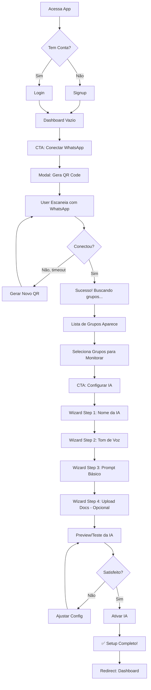
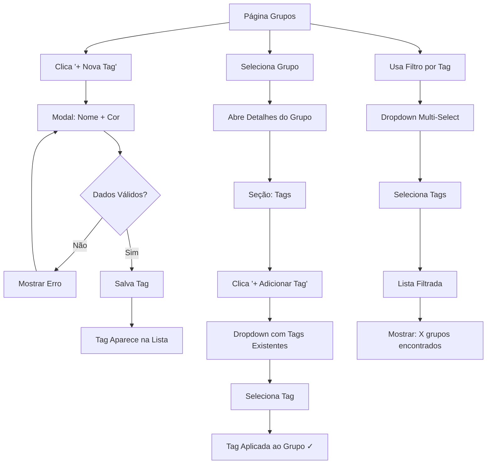
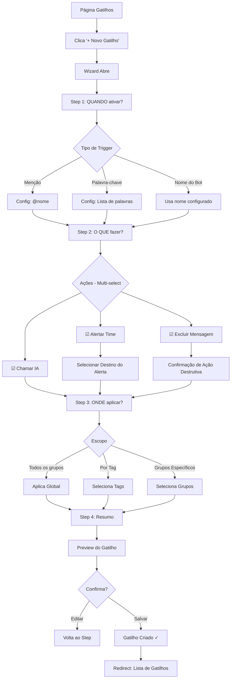
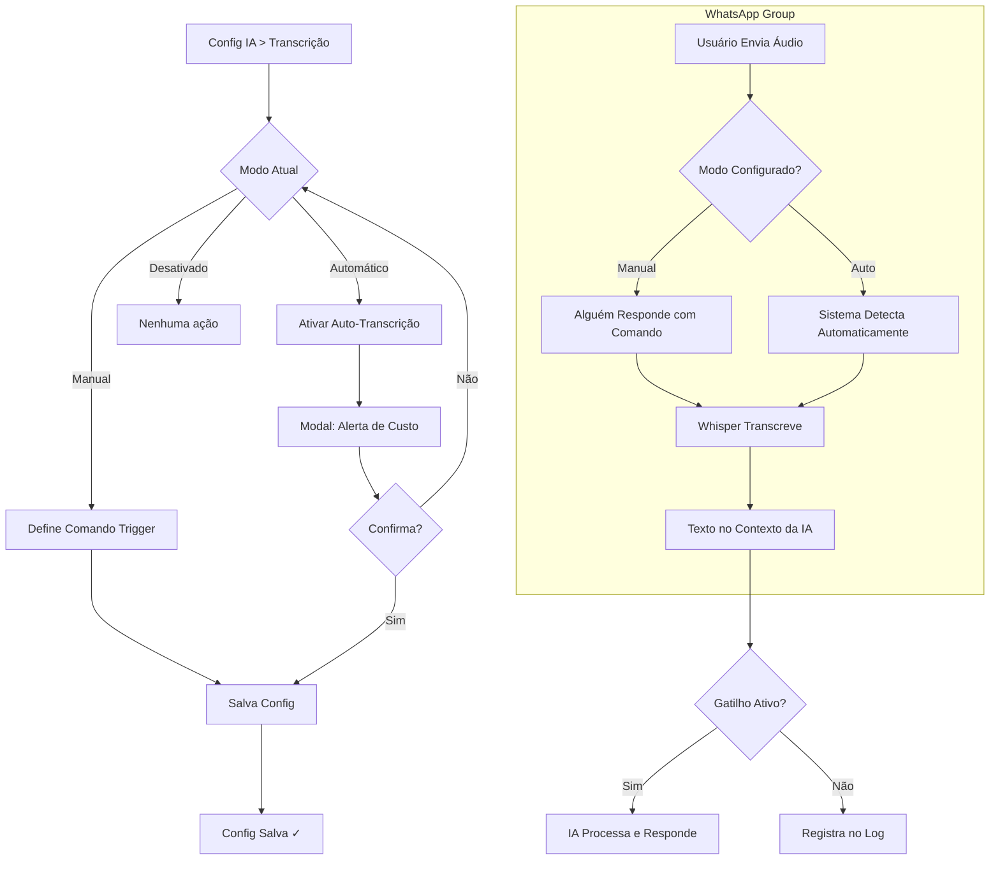

# UI/UX Specification
# WhatsApp Group Manager

## Document Info

| Field | Value |
|-------|-------|
| **Version** | 1.0 |
| **Date** | 2024 |
| **Author** | UX Expert Agent (BMAD Method) |
| **Status** | Approved |
| **Based On** | PRD v1.0 |

---

## 1. Introduction

Este documento define os objetivos de experiência do usuário, arquitetura de informação, fluxos de usuário e especificações visuais para o **WhatsApp Group Manager**. Serve como base para o design visual e desenvolvimento frontend, garantindo uma experiência coesa e centrada no usuário.

---

## 2. UX Goals & Principles

### 2.1 Target User Personas

| Persona | Descrição | Necessidades | Pain Points |
|---------|-----------|--------------|-------------|
| **🏢 Gestor de Comunidade** | Administra grupos de empresa/marca, pouco tempo, precisa de eficiência | Monitorar múltiplos grupos, automatizar respostas, organizar por categorias | Comandos complexos, falta de visibilidade |
| **🎯 Influencer/Creator** | Gerencia comunidade de fãs, zero conhecimento técnico | Setup rápido, IA que representa sua "voz", zero manutenção | Interfaces técnicas, configuração manual |
| **👨‍💼 Time de Suporte** | Equipe que atende clientes via grupos WhatsApp | Logs de conversas, alertas de problemas, transcrição de áudios | Perder mensagens importantes, áudios longos |

### 2.2 Usability Goals

| Goal | Métrica de Sucesso | Como Medir |
|------|-------------------|------------|
| **Ease of Learning** | Setup completo em < 10 minutos | Time to first value |
| **Efficiency** | Configurar gatilho em < 2 minutos | Task completion time |
| **Error Prevention** | < 5% de erros de configuração | Error rate tracking |
| **Memorability** | Retornar após 30 dias sem reaprender | D30 task success rate |
| **Satisfaction** | NPS > 7 | NPS survey |

### 2.3 Design Principles

1. **Clareza > Complexidade** - Interface óbvia, sem necessidade de manual
2. **Progressive Disclosure** - Mostrar apenas o necessário em cada momento
3. **Feedback Imediato** - Toda ação tem resposta visual clara
4. **Mobile-Aware** - Funciona em mobile, otimizado para desktop
5. **WhatsApp-Familiar** - Usar padrões visuais que remetam ao WhatsApp

---

## 3. Information Architecture

### 3.1 Site Map

```
WhatsApp Group Manager
│
├── 🔐 Auth (Public)
│   ├── /login
│   ├── /signup
│   └── /forgot-password
│
├── 🏠 Dashboard (/)
│   ├── Status Overview
│   ├── Quick Stats
│   ├── Recent Activity
│   └── Quick Actions
│
├── 📱 Instâncias (/instances)
│   ├── Instance List
│   ├── /instances/connect (QR Code)
│   └── /instances/[id] (Details)
│
├── 👥 Grupos (/groups)
│   ├── Groups List
│   ├── Tag Management
│   ├── /groups/[id] (Group Details)
│   └── /groups/[id]/settings
│
├── 🤖 Configuração IA (/ai-config)
│   ├── /ai-config/prompt
│   ├── /ai-config/knowledge-base
│   ├── /ai-config/agenda
│   └── /ai-config/transcription
│
├── ⚡ Gatilhos (/triggers)
│   ├── Triggers List
│   ├── /triggers/new (Wizard)
│   └── /triggers/[id]/edit
│
├── 📜 Logs (/logs)
│   ├── /logs/messages
│   ├── /logs/ai-responses
│   └── /logs/alerts
│
└── ⚙️ Configurações (/settings)
    ├── /settings/profile
    ├── /settings/billing
    └── /settings/account
```

### 3.2 Navigation Structure

| Type | Description | Behavior |
|------|-------------|----------|
| **Primary Nav** | Sidebar fixa com ícones + labels | Always visible on desktop, collapsible on mobile |
| **Secondary Nav** | Tabs dentro de seções | Horizontal tabs under page header |
| **Breadcrumbs** | Apenas níveis profundos | Show on detail pages (e.g., Groups > Group X) |
| **Quick Actions** | Botões de ação principal | Floating button on mobile, header button on desktop |

### 3.3 Navigation Items

```
┌─────────────────────────┐
│  [Logo]                 │
│                         │
│  🏠 Dashboard           │
│  📱 Instâncias          │
│  👥 Grupos              │
│  🤖 Configuração IA     │
│  ⚡ Gatilhos            │
│  📜 Logs                │
│                         │
│  ─────────────────────  │
│                         │
│  ⚙️ Configurações       │
│                         │
│  ─────────────────────  │
│  📊 Uso: ██████░ 65%    │
│  Plano: Pro             │
└─────────────────────────┘
```

---

## 4. User Flows

### 4.1 Flow 1: Onboarding (First-Time Setup)

**Goal**: Conectar WhatsApp e configurar IA em menos de 10 minutos.

**Entry Points**: Após signup, dashboard vazio

**Success Criteria**: Instância conectada, pelo menos 1 grupo ativo, IA configurada



**Edge Cases & Error Handling**:
- QR expira → Auto-refresh com countdown
- WhatsApp desconecta durante setup → Salvar progresso, retomar do ponto
- Nenhum grupo encontrado → Orientação para adicionar bot em grupos
- Upload de documento falha → Retry com feedback de erro

---

### 4.2 Flow 2: Tag Management

**Goal**: Organizar grupos usando tags coloridas.

**Entry Points**: Página de Grupos, Detalhes do Grupo

**Success Criteria**: Tags criadas e atribuídas a grupos



**UI Details**:
- Tags como chips coloridos com ícone de "x" para remover
- Dropdown com autocomplete para buscar tags
- Limite de 10 tags por grupo
- 8 cores predefinidas para escolha

---

### 4.3 Flow 3: Create Trigger (Wizard)

**Goal**: Criar automação com 4 passos simples.

**Entry Points**: Botão "+ Novo Gatilho" na página de Gatilhos

**Success Criteria**: Gatilho criado e ativo



**Wizard Steps UI**:

| Step | Title | Content |
|------|-------|---------|
| 1 | Quando ativar? | Radio buttons para tipo + config específica |
| 2 | O que fazer? | Checkboxes de ações + configs adicionais |
| 3 | Onde aplicar? | Radio + seletor condicional |
| 4 | Resumo | Card com todas as configs + botões |

---

### 4.4 Flow 4: Audio Transcription

**Goal**: Configurar e usar transcrição de áudio.

**Entry Points**: Config IA > Transcrição

**Success Criteria**: Áudio transcrito e incluído no contexto



**Cost Warning UI**:
```
┌─────────────────────────────────────────────┐
│  ⚠️ Atenção: Custos de Transcrição         │
│                                             │
│  O modo automático transcreve TODOS os      │
│  áudios recebidos nos grupos monitorados.   │
│                                             │
│  Custo estimado: ~R$0,006 por minuto        │
│                                             │
│  Exemplo: 100 minutos/dia = ~R$18/mês       │
│                                             │
│  [Cancelar]              [Entendi, Ativar]  │
└─────────────────────────────────────────────┘
```

---

## 5. Key Screen Layouts

### 5.1 Dashboard

```
┌────────────────────────────────────────────────────────────────────────┐
│  [Logo] WhatsApp Group Manager                    [🔔] [Avatar ▼]      │
├───────────────┬────────────────────────────────────────────────────────┤
│               │                                                        │
│  🏠 Dashboard │   Olá, [Nome]! 👋                                      │
│               │                                                        │
│  📱 Instâncias│   ┌──────────┐  ┌──────────┐  ┌──────────┐            │
│               │   │ 🟢 1     │  │ 👥 12    │  │ 💬 847   │            │
│  👥 Grupos    │   │Instância │  │ Grupos   │  │Mensagens │            │
│               │   │ Online   │  │ Ativos   │  │  Hoje    │            │
│  🤖 Config IA │   └──────────┘  └──────────┘  └──────────┘            │
│               │                                                        │
│  ⚡ Gatilhos  │   ┌──────────┐  ┌──────────┐  ┌──────────┐            │
│               │   │ 🤖 156   │  │ 🎤 23    │  │ ⚡ 5     │            │
│  📜 Logs      │   │Respostas │  │ Áudios   │  │Gatilhos  │            │
│               │   │   IA     │  │Transcritos│ │ Ativos   │            │
│  ─────────────│   └──────────┘  └──────────┘  └──────────┘            │
│               │                                                        │
│  ⚙️ Config    │   ATIVIDADE RECENTE                                    │
│               │   ┌────────────────────────────────────────────────┐  │
│  ─────────────│   │ 14:32  IA respondeu em "Grupo Vendas"          │  │
│  📊 Uso       │   │ 14:28  Áudio transcrito (0:45) em "Suporte"    │  │
│  ████████░░   │   │ 14:15  Alerta: palavra "reclamação" detectada  │  │
│  80% usado    │   │ 14:01  Novo membro em "Comunidade"             │  │
│               │   └────────────────────────────────────────────────┘  │
│               │                                                        │
│               │   AÇÕES RÁPIDAS                                        │
│               │   [+ Conectar Instância]  [+ Criar Gatilho]           │
│               │                                                        │
└───────────────┴────────────────────────────────────────────────────────┘
```

---

### 5.2 Groups List

```
┌────────────────────────────────────────────────────────────────────────┐
│  GRUPOS                                    [+ Importar]  [🔍 Buscar]   │
├────────────────────────────────────────────────────────────────────────┤
│  Filtros: [Todas Tags ▼] [Status ▼] [Ordenar: Recentes ▼]             │
│                                                                        │
│  Mostrando 12 grupos                                                   │
├────────────────────────────────────────────────────────────────────────┤
│                                                                        │
│  ┌──────────────────────────────────────────────────────────────────┐ │
│  │ 🖼️  Grupo Vendas Premium               🟢 Monitorando    [⚙️]    │ │
│  │     👥 156 membros  ·  💬 23 mensagens hoje                       │ │
│  │     🏷️ [Vendas] [Premium] [Ativos]                                │ │
│  └──────────────────────────────────────────────────────────────────┘ │
│                                                                        │
│  ┌──────────────────────────────────────────────────────────────────┐ │
│  │ 🖼️  Suporte Técnico                    🟢 Monitorando    [⚙️]    │ │
│  │     👥 89 membros  ·  💬 45 mensagens hoje                        │ │
│  │     🏷️ [Suporte]                                                  │ │
│  └──────────────────────────────────────────────────────────────────┘ │
│                                                                        │
│  ┌──────────────────────────────────────────────────────────────────┐ │
│  │ 🖼️  Comunidade Geral                   ⚪ Pausado         [⚙️]    │ │
│  │     👥 1.2k membros  ·  💬 0 mensagens hoje                       │ │
│  │     🏷️ [Comunidade]                                               │ │
│  └──────────────────────────────────────────────────────────────────┘ │
│                                                                        │
│  ┌──────────────────────────────────────────────────────────────────┐ │
│  │ 🖼️  Clientes VIP                       🟢 Monitorando    [⚙️]    │ │
│  │     👥 45 membros  ·  💬 12 mensagens hoje                        │ │
│  │     🏷️ [VIP] [Premium]                                            │ │
│  └──────────────────────────────────────────────────────────────────┘ │
│                                                                        │
│                        [Carregar mais...]                              │
│                                                                        │
└────────────────────────────────────────────────────────────────────────┘
```

---

### 5.3 AI Configuration - Prompt Editor

```
┌────────────────────────────────────────────────────────────────────────┐
│  CONFIGURAÇÃO DA IA                                                    │
├────────────────────────────────────────────────────────────────────────┤
│  [Prompt ✓]  [Base Conhecimento]  [Agenda]  [Transcrição]             │
├────────────────────────────────────────────────────────────────────────┤
│                                                                        │
│  NOME DA IA                                                            │
│  ┌────────────────────────────────────────────────────────────────┐   │
│  │ Assistente                                                      │   │
│  └────────────────────────────────────────────────────────────────┘   │
│  Este nome será usado para ativar a IA quando mencionado.              │
│                                                                        │
│  TOM DE VOZ                                                            │
│  ○ Formal   ● Amigável   ○ Divertido   ○ Técnico                      │
│                                                                        │
│  PROMPT DO SISTEMA                                                     │
│  ┌────────────────────────────────────────────────────────────────┐   │
│  │ Você é o Assistente, um bot amigável que ajuda os membros      │   │
│  │ do grupo a tirar dúvidas sobre nossos produtos e serviços.     │   │
│  │                                                                 │   │
│  │ Regras importantes:                                             │   │
│  │ - Seja sempre educado e prestativo                              │   │
│  │ - Se não souber a resposta, diga que vai verificar              │   │
│  │ - Nunca invente informações sobre preços ou prazos              │   │
│  │ - Use emojis com moderação para parecer amigável                │   │
│  │ - Responda de forma concisa (max 3 parágrafos)                  │   │
│  │                                                                 │   │
│  │ Informações da empresa:                                         │   │
│  │ - Nome: [Nome da Empresa]                                       │   │
│  │ - Horário: Seg-Sex, 9h às 18h                                   │   │
│  │ - Contato humano: chamar @admin                                 │   │
│  │ ░░░░░░░░░░░░░░░░░░░░░░░░░░░░░░░░░░░░░░░░░░░░░░░░░░░░░░░░░░░░░  │   │
│  └────────────────────────────────────────────────────────────────┘   │
│  📊 847 caracteres · Última atualização: há 2 dias                     │
│                                                                        │
│  VARIÁVEIS DISPONÍVEIS                                                 │
│  {user_name} - Nome do usuário que enviou a mensagem                   │
│  {group_name} - Nome do grupo                                          │
│  {current_date} - Data atual                                           │
│                                                                        │
│  ┌─────────────────────────────────────────────────────────────────┐  │
│  │ [🧪 Testar Prompt]                              [💾 Salvar]     │  │
│  └─────────────────────────────────────────────────────────────────┘  │
│                                                                        │
└────────────────────────────────────────────────────────────────────────┘
```

---

### 5.4 Trigger Wizard - Step 2 (Actions)

```
┌────────────────────────────────────────────────────────────────────────┐
│  CRIAR GATILHO                                           [✕ Fechar]    │
├────────────────────────────────────────────────────────────────────────┤
│                                                                        │
│  ○───────●───────○───────○                                             │
│  Quando   O que    Onde    Resumo                                      │
│                                                                        │
├────────────────────────────────────────────────────────────────────────┤
│                                                                        │
│  Configuração anterior: Palavra-chave "preço, valor, quanto custa"     │
│                                                                        │
│  ─────────────────────────────────────────────────────────────────     │
│                                                                        │
│  O QUE FAZER QUANDO O GATILHO ATIVAR?                                  │
│                                                                        │
│  ┌──────────────────────────────────────────────────────────────────┐ │
│  │ ☑️ Chamar a IA para responder                                    │ │
│  │    └── A IA usará o prompt e base de conhecimento configurados   │ │
│  └──────────────────────────────────────────────────────────────────┘ │
│                                                                        │
│  ┌──────────────────────────────────────────────────────────────────┐ │
│  │ ☑️ Alertar o time                                                │ │
│  │    └── Enviar para: [Grupo Admins          ▼]                    │ │
│  │    └── Mensagem: "⚠️ Palavra detectada: {keyword} em {group}"    │ │
│  └──────────────────────────────────────────────────────────────────┘ │
│                                                                        │
│  ┌──────────────────────────────────────────────────────────────────┐ │
│  │ ☐ Excluir a mensagem automaticamente                             │ │
│  │    └── ⚠️ Ação irreversível! Use com cuidado.                    │ │
│  └──────────────────────────────────────────────────────────────────┘ │
│                                                                        │
│  ┌──────────────────────────────────────────────────────────────────┐ │
│  │ ☐ Enviar para webhook externo                                    │ │
│  │    └── URL: [________________________________________]           │ │
│  └──────────────────────────────────────────────────────────────────┘ │
│                                                                        │
│                                                                        │
│                              [← Voltar]  [Próximo: Onde Aplicar →]    │
│                                                                        │
└────────────────────────────────────────────────────────────────────────┘
```

---

### 5.5 Logs Page

```
┌────────────────────────────────────────────────────────────────────────┐
│  LOGS                                               [📥 Exportar CSV]  │
├────────────────────────────────────────────────────────────────────────┤
│  [Mensagens]  [Respostas IA ✓]  [Alertas]                              │
├────────────────────────────────────────────────────────────────────────┤
│                                                                        │
│  Filtros:                                                              │
│  [Todos os Grupos ▼]  [Últimos 7 dias ▼]  [🔍 Buscar conteúdo...]     │
│                                                                        │
│  234 registros encontrados                                             │
│                                                                        │
├────────────────────────────────────────────────────────────────────────┤
│  TIMESTAMP        │ GRUPO           │ TRIGGER    │ TOKENS │ TEMPO     │
├────────────────────────────────────────────────────────────────────────┤
│                                                                        │
│  14:32:15         │ Grupo Vendas    │ @mention   │ 423    │ 1.2s      │
│  ├─ Pergunta: "Assistente, qual o preço do plano pro?"                 │
│  └─ Resposta: "O plano Pro custa R$97/mês e inclui..."                 │
│                                                           [Ver mais ▼] │
│  ─────────────────────────────────────────────────────────────────     │
│                                                                        │
│  14:28:47         │ Suporte         │ keyword    │ 567    │ 2.1s      │
│  ├─ Pergunta: "quanto custa a instalação?"                             │
│  └─ Resposta: "A instalação é gratuita para..."                        │
│                                                           [Ver mais ▼] │
│  ─────────────────────────────────────────────────────────────────     │
│                                                                        │
│  14:15:23         │ Comunidade      │ keyword    │ 312    │ 0.9s      │
│  ├─ Pergunta: "tem desconto para estudantes?"                          │
│  └─ Resposta: "Sim! Oferecemos 20% de desconto..."                     │
│                                                           [Ver mais ▼] │
│  ─────────────────────────────────────────────────────────────────     │
│                                                                        │
│                        [1] [2] [3] ... [12]  [Próxima →]               │
│                                                                        │
└────────────────────────────────────────────────────────────────────────┘
```

---

### 5.6 QR Code Connection Modal

```
┌────────────────────────────────────────────────────────────────────────┐
│                                                            [✕]         │
│                                                                        │
│                    CONECTAR WHATSAPP                                   │
│                                                                        │
│           ┌─────────────────────────────────┐                         │
│           │                                 │                         │
│           │         ████████████           │                         │
│           │         ██        ██           │                         │
│           │         ██  ████  ██           │                         │
│           │         ██  ████  ██           │                         │
│           │         ██        ██           │                         │
│           │         ████████████           │                         │
│           │                                 │                         │
│           └─────────────────────────────────┘                         │
│                                                                        │
│                    ⏱️ Expira em: 00:45                                 │
│                                                                        │
│           ─────────────────────────────────────                       │
│                                                                        │
│           COMO ESCANEAR:                                               │
│                                                                        │
│           1. Abra o WhatsApp no celular                               │
│           2. Toque em ⋮ Menu > Aparelhos conectados                   │
│           3. Toque em "Conectar um aparelho"                          │
│           4. Aponte a câmera para este QR Code                        │
│                                                                        │
│           ─────────────────────────────────────                       │
│                                                                        │
│           🔒 Sua conexão é segura e criptografada                      │
│                                                                        │
│                      [Gerar Novo QR Code]                             │
│                                                                        │
└────────────────────────────────────────────────────────────────────────┘
```

---

## 6. Component Library

### 6.1 Design System Base

**Framework**: shadcn/ui + Tailwind CSS

**Why shadcn/ui**:
- Componentes acessíveis (Radix UI)
- Customizáveis (não opinativo)
- Copy-paste (não dependência)
- TypeScript nativo
- Dark mode ready

### 6.2 Core Components

| Component | Variants | States | Usage |
|-----------|----------|--------|-------|
| **Button** | Primary, Secondary, Ghost, Danger, Outline | Default, Hover, Active, Disabled, Loading | CTAs, ações |
| **Input** | Text, Password, Search, Textarea | Default, Focus, Error, Disabled | Forms |
| **Select** | Single, Multi | Open, Closed, Filtering | Dropdowns |
| **Card** | Default, Interactive, Selectable | Default, Hover, Selected | List items |
| **Badge/Chip** | Colored, Removable | Default, Hover | Tags, status |
| **Toggle** | Default | On, Off, Disabled | Settings |
| **Modal/Dialog** | Small, Medium, Large | Open, Closing | Confirmações |
| **Toast** | Success, Error, Warning, Info | Appearing, Dismissing | Feedback |
| **Tabs** | Default, Pills | Active, Inactive | Navigation |
| **Tooltip** | Default | Hidden, Visible | Contextual help |
| **Skeleton** | Line, Circle, Card | Loading | Loading states |
| **Avatar** | Image, Initials | Default | Users, groups |
| **Progress** | Bar, Circle | 0-100% | Usage, loading |

### 6.3 Component Specifications

#### Button

```tsx
// Variants
<Button variant="default">Primary Action</Button>
<Button variant="secondary">Secondary</Button>
<Button variant="ghost">Ghost</Button>
<Button variant="destructive">Delete</Button>
<Button variant="outline">Outline</Button>

// Sizes
<Button size="sm">Small</Button>
<Button size="default">Default</Button>
<Button size="lg">Large</Button>

// States
<Button disabled>Disabled</Button>
<Button loading>Loading...</Button>

// With Icon
<Button><PlusIcon className="mr-2" /> Add New</Button>
```

#### Tag/Badge

```tsx
// Colored tags for groups
const tagColors = {
  blue: "bg-blue-100 text-blue-800",
  green: "bg-green-100 text-green-800",
  yellow: "bg-yellow-100 text-yellow-800",
  red: "bg-red-100 text-red-800",
  purple: "bg-purple-100 text-purple-800",
  pink: "bg-pink-100 text-pink-800",
  orange: "bg-orange-100 text-orange-800",
  gray: "bg-gray-100 text-gray-800",
};

<Badge color="blue" removable onRemove={handleRemove}>
  Vendas
</Badge>
```

#### Status Indicator

```tsx
// Connection status
<StatusDot status="online" />   // 🟢
<StatusDot status="offline" />  // 🔴
<StatusDot status="connecting" /> // 🟡 (pulse animation)

// Monitoring status
<MonitoringBadge active={true} />  // "🟢 Monitorando"
<MonitoringBadge active={false} /> // "⚪ Pausado"
```

---

## 7. Branding & Style Guide

### 7.1 Color Palette

```css
:root {
  /* Primary - WhatsApp Green */
  --primary: #25D366;
  --primary-hover: #1DA851;
  --primary-light: #DCF8C6;
  
  /* Secondary - WhatsApp Dark */
  --secondary: #128C7E;
  --secondary-hover: #075E54;
  
  /* Accent - WhatsApp Blue */
  --accent: #34B7F1;
  
  /* Neutrals */
  --background: #F0F2F5;
  --surface: #FFFFFF;
  --surface-hover: #F5F6F6;
  --border: #E9EDEF;
  
  /* Text */
  --text-primary: #111B21;
  --text-secondary: #667781;
  --text-muted: #8696A0;
  
  /* Semantic */
  --success: #22C55E;
  --warning: #F59E0B;
  --error: #EF4444;
  --info: #3B82F6;
}
```

### 7.2 Typography

```css
/* Font Family */
font-family: 'Inter', -apple-system, BlinkMacSystemFont, sans-serif;

/* Font Sizes */
--text-xs: 0.75rem;    /* 12px */
--text-sm: 0.875rem;   /* 14px */
--text-base: 1rem;     /* 16px */
--text-lg: 1.125rem;   /* 18px */
--text-xl: 1.25rem;    /* 20px */
--text-2xl: 1.5rem;    /* 24px */
--text-3xl: 1.875rem;  /* 30px */

/* Font Weights */
--font-normal: 400;
--font-medium: 500;
--font-semibold: 600;
--font-bold: 700;

/* Line Heights */
--leading-tight: 1.25;
--leading-normal: 1.5;
--leading-relaxed: 1.625;
```

### 7.3 Spacing

```css
/* Base unit: 4px */
--space-1: 0.25rem;  /* 4px */
--space-2: 0.5rem;   /* 8px */
--space-3: 0.75rem;  /* 12px */
--space-4: 1rem;     /* 16px */
--space-5: 1.25rem;  /* 20px */
--space-6: 1.5rem;   /* 24px */
--space-8: 2rem;     /* 32px */
--space-10: 2.5rem;  /* 40px */
--space-12: 3rem;    /* 48px */
```

### 7.4 Border Radius

```css
--radius-sm: 4px;    /* Inputs, small elements */
--radius-md: 8px;    /* Cards, modals */
--radius-lg: 12px;   /* Large cards */
--radius-xl: 16px;   /* Panels */
--radius-full: 9999px; /* Pills, avatars */
```

### 7.5 Shadows

```css
--shadow-sm: 0 1px 2px 0 rgb(0 0 0 / 0.05);
--shadow-md: 0 4px 6px -1px rgb(0 0 0 / 0.1);
--shadow-lg: 0 10px 15px -3px rgb(0 0 0 / 0.1);
--shadow-xl: 0 20px 25px -5px rgb(0 0 0 / 0.1);
```

---

## 8. Responsive Design

### 8.1 Breakpoints

| Breakpoint | Width | Layout Changes |
|------------|-------|----------------|
| **Mobile** | < 640px | Sidebar hidden, bottom nav, single column |
| **Tablet** | 640-1024px | Sidebar collapsed (icons only), 2 columns |
| **Desktop** | > 1024px | Sidebar expanded, 3+ columns |

### 8.2 Responsive Patterns

#### Sidebar Behavior

```
Desktop (>1024px):
┌──────────┬─────────────────────────────┐
│ Sidebar  │                             │
│ Expanded │       Main Content          │
│ (240px)  │                             │
└──────────┴─────────────────────────────┘

Tablet (640-1024px):
┌────┬────────────────────────────────────┐
│Icon│                                    │
│Bar │         Main Content               │
│64px│                                    │
└────┴────────────────────────────────────┘

Mobile (<640px):
┌─────────────────────────────────────────┐
│           Main Content                  │
│                                         │
├─────────────────────────────────────────┤
│  🏠    📱    👥    🤖    ⚙️             │
│ Home  Inst  Groups  AI   Settings       │
└─────────────────────────────────────────┘
```

#### Cards Grid

```css
/* Group cards responsive grid */
.groups-grid {
  display: grid;
  gap: 1rem;
  grid-template-columns: repeat(auto-fill, minmax(300px, 1fr));
}
```

---

## 9. Accessibility

### 9.1 WCAG 2.1 AA Compliance

| Requirement | Implementation |
|-------------|----------------|
| **Color Contrast** | Minimum 4.5:1 for text, 3:1 for large text |
| **Keyboard Navigation** | All interactive elements focusable, logical tab order |
| **Focus Indicators** | Visible focus ring on all focusable elements |
| **Screen Readers** | ARIA labels, live regions for dynamic content |
| **Reduced Motion** | Respect `prefers-reduced-motion` |
| **Color Independence** | Don't rely on color alone for information |

### 9.2 ARIA Implementation

```tsx
// Status announcements
<div role="status" aria-live="polite">
  {message}
</div>

// Loading states
<button aria-busy={isLoading} aria-disabled={isLoading}>
  {isLoading ? "Salvando..." : "Salvar"}
</button>

// Form validation
<input
  aria-invalid={hasError}
  aria-describedby="email-error"
/>
<span id="email-error" role="alert">
  {errorMessage}
</span>
```

---

## 10. Animation & Motion

### 10.1 Motion Principles

1. **Purposeful** - Animations should guide, not distract
2. **Fast** - Keep animations under 300ms
3. **Subtle** - Prefer subtle over dramatic
4. **Consistent** - Same easing throughout

### 10.2 Animation Specifications

| Animation | Duration | Easing | CSS |
|-----------|----------|--------|-----|
| **Fade In** | 150ms | ease-out | `opacity 150ms ease-out` |
| **Fade Out** | 100ms | ease-in | `opacity 100ms ease-in` |
| **Slide In** | 200ms | ease-out | `transform 200ms ease-out` |
| **Scale** | 150ms | ease-out | `transform 150ms ease-out` |
| **Expand** | 200ms | ease-in-out | `height 200ms ease-in-out` |
| **Skeleton Pulse** | 1.5s | ease-in-out | `opacity 1.5s ease-in-out infinite` |
| **Spinner** | 1s | linear | `transform 1s linear infinite` |
| **Success Check** | 400ms | spring | Custom spring animation |

### 10.3 Tailwind Animation Classes

```css
/* Custom animations in tailwind.config.js */
animation: {
  'fade-in': 'fadeIn 150ms ease-out',
  'fade-out': 'fadeOut 100ms ease-in',
  'slide-in': 'slideIn 200ms ease-out',
  'slide-out': 'slideOut 150ms ease-in',
  'scale-in': 'scaleIn 150ms ease-out',
  'pulse-slow': 'pulse 3s ease-in-out infinite',
  'spin-slow': 'spin 2s linear infinite',
}

@keyframes fadeIn {
  from { opacity: 0; }
  to { opacity: 1; }
}

@keyframes slideIn {
  from { transform: translateY(-10px); opacity: 0; }
  to { transform: translateY(0); opacity: 1; }
}

@keyframes scaleIn {
  from { transform: scale(0.95); opacity: 0; }
  to { transform: scale(1); opacity: 1; }
}
```

---

## 11. Error States & Edge Cases

### 11.1 Empty States

| Screen | Empty State Message | CTA |
|--------|---------------------|-----|
| **Dashboard** | "Conecte seu WhatsApp para começar" | "Conectar Agora" |
| **Groups** | "Nenhum grupo encontrado" | "Verificar Conexão" |
| **Triggers** | "Crie seu primeiro gatilho" | "+ Novo Gatilho" |
| **Logs** | "Nenhum registro encontrado" | - |
| **Knowledge Base** | "Adicione documentos para a IA" | "+ Upload" |

### 11.2 Error Messages

| Error Type | Message | Action |
|------------|---------|--------|
| **Network** | "Falha na conexão. Verifique sua internet." | Retry button |
| **Auth** | "Sessão expirada. Faça login novamente." | Redirect to login |
| **WhatsApp Disconnect** | "WhatsApp desconectado. Reconecte para continuar." | Reconnect button |
| **Rate Limit** | "Muitas requisições. Aguarde alguns segundos." | Auto-retry |
| **Plan Limit** | "Limite do plano atingido. Faça upgrade." | Upgrade button |

### 11.3 Loading States

```
┌─────────────────────────────────────┐
│ ▓▓▓▓▓▓▓▓▓▓▓▓▓▓▓▓▓▓▓▓▓▓▓▓          │  Skeleton for cards
│ ▓▓▓▓▓▓▓▓▓▓  ▓▓▓▓                   │
│ ▓▓▓▓▓▓▓▓▓▓▓▓▓▓▓▓▓▓                 │
└─────────────────────────────────────┘

[○ ● ○] Connecting...               Spinner with text

████████░░░░░░░░ 45%               Progress bar with percentage
```

---

## 12. Performance Considerations

### 12.1 Performance Goals

| Metric | Target |
|--------|--------|
| **First Contentful Paint (FCP)** | < 1.5s |
| **Largest Contentful Paint (LCP)** | < 2.5s |
| **Time to Interactive (TTI)** | < 3.0s |
| **Cumulative Layout Shift (CLS)** | < 0.1 |
| **First Input Delay (FID)** | < 100ms |

### 12.2 Design Strategies for Performance

1. **Skeleton loading** - Show content structure immediately
2. **Progressive image loading** - Blur-up technique for avatars
3. **Virtual scrolling** - For long lists (logs, groups)
4. **Optimistic updates** - Update UI before server confirms
5. **Lazy loading** - Load modals and heavy components on demand

---

## 13. Next Steps

### 13.1 Immediate Actions

1. [ ] Review this spec with stakeholders
2. [ ] Create visual designs in Figma (optional)
3. [ ] Prepare for handoff to Architect

### 13.2 Design Handoff Checklist

- [x] All user flows documented
- [x] Component inventory complete
- [x] Accessibility requirements defined
- [x] Responsive strategy clear
- [x] Brand guidelines incorporated
- [x] Performance goals established

---

## Appendix A: Icon Reference

Using **Lucide React** icons:

| Icon | Usage |
|------|-------|
| `Home` | Dashboard |
| `Smartphone` | Instances |
| `Users` | Groups |
| `Bot` | AI Config |
| `Zap` | Triggers |
| `FileText` | Logs |
| `Settings` | Settings |
| `Plus` | Add actions |
| `Search` | Search fields |
| `X` | Close, remove |
| `Check` | Success, selected |
| `AlertCircle` | Warnings |
| `Info` | Information |
| `Loader2` | Loading spinner |
| `ChevronDown` | Dropdowns |
| `ExternalLink` | External links |

---

## Appendix B: Figma Structure (If Created)

```
📁 WhatsApp Group Manager
├── 📁 Design System
│   ├── Colors
│   ├── Typography
│   ├── Spacing
│   └── Components
├── 📁 Pages
│   ├── Auth (Login, Signup)
│   ├── Dashboard
│   ├── Instances
│   ├── Groups
│   ├── AI Config
│   ├── Triggers
│   ├── Logs
│   └── Settings
├── 📁 Flows
│   ├── Onboarding
│   ├── Tag Management
│   ├── Trigger Creation
│   └── Audio Transcription
└── 📁 Prototypes
    └── Main Flow
```
